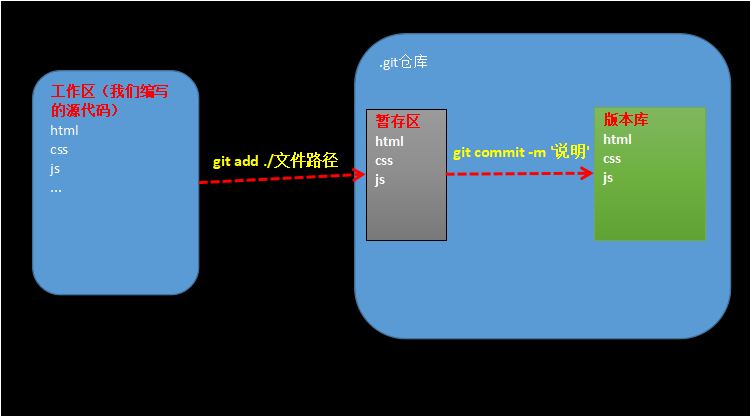

# Git

## 什么是Git

Git是源代码管理工具（软件）

## Git的基本使用

### 1. 初始化仓库

+ 在项目目录中使用命令：**`git init`** 初始化目录 

### 2. 设置用户名和邮箱（自报家门）

+ 配置用户名命令：**`git config --global user.name "用户名"`** 
+ 配置邮箱命令：**`git config --global user.email "邮箱"`** 

### 3. 代码添加到git仓库并提交代码库

1.  通过命令：**`git add`**  把修改的文件存入暂存区
   - `git add ./文件名` 把指定修改的文件存入到暂存区。
   - `git add ./` 把所有的修改的文件存入到暂存区。
2.  通过命令：**`git commit -m '提交说明'`**  把暂存区中的文件存入到版本库中
   + `git commit -m "这是对这次添加的东西的说明" `
   + `git commit --all -m "一些说明"`
     + 注意：--all 表示不需要通过add命令而是直接是把所有修改的文件提交到版本库。

### 4. 查看当前状态

+ 命令：**`git status`**  可以查看当前工作区中是否有修改的文件添加到暂存区或版本库中

### 5. 设置忽略提交文件

在工作区中新建一个**`.gitignore`** 文件，在该文件中做配置

- .gitignore,在这个文件中可以设置要被忽略的文件或者目录。
- 被忽略的文件不会被提交仓储里去.
- 在.gitignore中可以书写要被忽略的文件的路径，以/开头，
  一行写一个路径，这些路径所对应的文件都会被忽略，
  不会被提交到仓储中
  - 写法
    - ` /.idea  ` 会忽略.idea文件
    - ` /js`      会忽略js目录里的所有文件
    - ` /js/*.js` 会忽略js目录下所有js文件

### 6. 版本回退

- **`git reset --hard Head~0`** 
  - 表示回退到上一次代码提交时的状态
- **`git reset --hard Head~1`** 
  - 表示回退到上上次代码提交时的状态
- **`git reset --hard [版本号]`** 
  - 可以通过版本号精确的回退到某一次提交时的状态

### 7.查看日志

- **`git log`**  查看历史提交的日志
- **`git log --oneline`**  可以看到简洁版的日志
- **`git reflog`** 可以看到每一次切换版本的记录:可以看到所有提交的版本号

## Git分支操作

默认是有一个主分支**master** 

### 1. 创建分支

+ 命令：**`git branch dev`** 
  - 创建了一个dev分支
  - 在刚创建时dev分支里的东西和master分支里的东西是一样的

### 2. 查看分支

+ 命令：**`git branch`**

### 3. 切换分支

+ **`git checkout dev`**
  + 切换到指定的分支,这里的切换到名为dev的分支

### 4. 合并分支

- **`git merge dev`** 
  - 合并分支内容,把当前分支与指定的分支(dev),进行合并
  - 当前分支指的是`git branch`命令输出的前面有*号的分支
- 合并时如果有冲突，需要手动去处理，处理后还需要再提交一次.

## Git远程操作

### 1. 上传

- `git push [地址] master`

- 示例: `git push https://github.com/huoqishi/test112.git master`
- 会把当前分支的内容上传到远程的master分支上

### 2. 获取

- `git pull [地址] master`

- 示例: `git pull https://github.com/huoqishi/test112.git master`
- 会把远程分支的数据得到:(*注意本地-要初始一个仓储!*)

- `git clone [地址]`

- 会得到远程仓储相同的数据,如果多次执行会覆盖本地内容。

### 3. ssh上传

- 公钥 私钥,两者之间是有关联的。
- 生成公钥,和私钥
  - `ssh-keygen -t rsa -C "邮箱"`

### 4. 远程简写方式

+ 添加远程地址`git remote add 名称 地址`
  + 注意：仅仅是在本项目目录操作有效
  + 下次可以简化为：git push 名称 master
+ -u简化下次操作
  + `git push 远程名称 -u master` 
  + 下次可以简化为：git push

## 待续事项

+ 非github作为服务器的测试
+ ssh多人测试