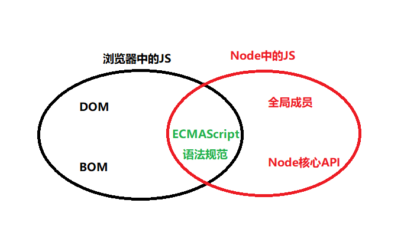

# NodeJS基础概念和ES6语法基础

## 一. NodeJs基础阶段目标

1. 【基础概念】

   - 什么是node.js以及node.js的特点
   - node.js适合做什么
   - 什么是模块化、什么是Common.js模块化规范
   - 模块、包、npm、包加载机制
   - ...

2. 【基本能力】

   - 掌握node.js中基本API的使用
   - 能够使用npm管理包
   - 能够使用ES6新语法
   - 能够使用node.js创建基本的web服务器

   ​

3. 【高阶内容】

   - 能够使用Express框架、结合mysql数据库实现后端网站

> 注意：整个node.js学习阶段，概念类知识点较多，需要理解透彻！


## 二. 了解基本的概念

### 2.1 语言和运行环境的关系

1. **语言，是编写代码的语法规范**；程序员遵循特定的语法规范，编写出来的代码，只是单纯的文本字符串而已，**并不具备可执行的特点**；

2. **环境（平台），提供了执行代码的能力**，如果程序员编写的代码想要成功执行，必须要依赖于特定的执行环境；

   - 例如：Javascript代码可以被浏览器中的JS解析引擎执行；
   - 所以，浏览器，就是一个 Javascript 的执行环境；因为 Javascript 代码可以在浏览器中被执行；

   ​

### 2.2 前端和后端的

1. **前端主要工作**
   1. 页面结构
   2. 美化页面样式
   3. 书写页面的业务逻辑
   4. 使用Ajax调用后台接口
2. **后端主要工作**
   1. 操作数据库
   2. 对外暴露操作数据库的API接口
3. **前后端协作开发** 


### 2.3 浏览器环境中的JavaScript

1. 诞生：上世纪 90年代左右，网景 liveScript、表单验证
2. 一战：
   - 主角：微软和网景
   - 结果：微软IE胜出
   - 胜利的果实：ECMAScript 语言标准的诞生
3. 二战
   - 主角：谷歌、火狐、IE
   - 结果：谷歌胜出
   - 胜利的果实：谷歌的V8引擎是最快的JS解析引擎
4. 回顾：**浏览器中 Javascript 的组成部分** 
   - ==ECMAScript核心 + DOM + BOM== 


### 2.4 Node环境中的JavaScript

1. [什么是 Node.js](http://nodejs.cn/)：就是 Javascript 的服务器端运行环境，可以让程序员使用 Javascript 来实现服务器端的编程；
2. **Node.js 中 Javascript 的组成部分** 
   - ==ECMAScript 核心 + 全局成员 + 核心 API 模块== 
   - 全局成员：console、setInterval、setTimeout。。。
   - 核心 API 模块：就是 Node 平台 单独提供的一些API，这些API是Node平台所独有的；
3. 注意：Node.js 中 没有 BOM 和 DOM
   1. 由于 Node 服务器端运行环境中，没有浏览器 和 HTML 的概念，所以，Node中的javascript 提出了 DOM 和 BOM 这两个对象模型，取而代之的，是 全局成员 和  核心 API 模块；


### 2.5 图解Node中的js和浏览器中的js的区别




### 2.6 总结

1. **什么是 Node.js(我们自己给它下个定义)**

   > 就是一个服务器端的Javascript运行环境，可以让程序员，通过 Javascript 做 后台服务器编程开发

2. **学习 Node.js 可以做什么**

   - 像 PHP 、Java等其他后端技术一样，使用 Javascript 编写符合规范的**后端 API 接口** 或 **网站**
   - 使用 Node.js 开发一些**实用的工具** 或 **包**
   - 基于 Socket 技术，开发类似于聊天室之类的**即时通讯项目**
   - 基于 Electron 环境，开发**桌面软件**
   - ...


## 三. Node环境安装

### 3.1 下载安装

1. 步骤1：进入[官网](http://nodejs.cn/download/)下载
2. 步骤2：双击软件下一步安装即可


### 3.2 查看Node版本号

1. 打开终端，在命令行输入命令`node -v`即可

2. **小技巧: 如何进入终端呢？**

   - 【推荐】在任意目录的空白位置，先按住`shift`键不松开，然后，在空白位置，鼠标右键单击，会出来一个右键菜单，选择`在此处打开 powershell/cmd 窗口`
   - 【了解】使用快捷键`windows徽标 + R`打开运行面板，输入 `cmd` 后直接回车；

   ​

### 3.4 path 环境变量

1. **什么是path环境变量**
   - Path环境变量的作用：能够让我们在终端中执行相关的命令，从而快速启动应用程序；
2. **系统环境变量和用户环境变量的区别**
   - 用户环境变量：仅仅当前用户可以使用
   - 系统环境变量：所有用户都可以使用
3. **通过终端输入命令的形式，快速启动应用程序时，路径的查找规则**
   - 先在当前运行 终端命令的 目录中查找，如果有则直接运行；
   - 如果当前运行 终端命令的 目录中没有，则去全局的path环境变量中查找；


## 四. NodeJS执行js程序的方式

### 4.1 node 命令【推荐】

1. 直接使用 `node 要执行的js文件的路径` 来执行指定的JS文件
   如：==node  test.js== 

> 小技巧：
>
> 1. 在终端中，使用键盘的↑, 可以快速定位到上一次执行的命令
> 2. 在终端中，使用键盘的 `tab` 键能够快速补全路径
> 3. windows 系统上，在终端中输入 `cls` 可以清屏


### 4.2 REPL 环境 - 了解

1. **如何进入 REPL 环境**： 打开任意终端，直接输入 `node` 并回车，就会进入到 REPL 环境中；
2. **如何离开 REPL 环境**：按两次`ctrl + c` 就能退出 REPL 环境；
3. **REPL中，每个字母代表什么意思呢**：

- **R**： Read 的意思，每当我们输入完毕代码之后，只要敲击回车，Node环境就会读取用户输入的代码
- **E**：Evaluate 的意思，表示把 Read 进来的用户代码，调用 类似于 Eval 的函数，去解析执行
- **P**：Print 输出的意思；把第二步中解析执行的结果，输出给用户；
- **L**：Loop 循环的意思，表示当输出完毕之后，进入下一次的 REP循环


## 五 .ES6常用语法

### 5.1 let关键字

+ **语法**：let 变量名 = 值;

+ **特性**：

  1. 不会变量提升
  2. 具有块级作用域

+ **代码：** 

  ```javascript
      // 1. 【不存在变量提升】
      // 报错，a is not defined
      console.log(a);
      let a = 123;
  ```

  ```javascript
      // 2. 【具有块级作用域】
      if(true) {
        let a = 123;
        console.log(a);
      }
  	// 报错 a is not defined
      console.log(a); 
  ```

  ​

### 5.2 const关键字

+ **语法：** const 常量名 = 值;

+ **特性：** 

  1. 不会变量提升
  2. 变量不能重复赋值
  3. 创建常量时必须初始化值，否则报错

+ **代码：** 

  ```javascript
  // 1.【不会变量提升】
  // 报错，AGE is not defined
  console.log(AGE);  
  const AGE = 10;
  ```

  ```javascript
  // 2. 【不能重复赋值】
  const AGE = 10;
  console.log(AGE);
  // 报错：Assignment to constant variable 声明的变量时恒定不变的
  AGE = 12;       
  ```

  ```javascript
  // 3. 【常量必须初始化】
  // 报错：Missing initializer in const declaration 常量声明缺少初始化
  const AGE;          
  ```

  ​

### 5.3 变量解构赋值

+ **语法1：**let 或 const  {键名,键名,键名...} = 对象

+ **语法2：**let 或 const  {键名:别名,键名:别名,键名...} = 对象

+ **注意：** 

  > ​	若键名设置了别名，则原有的键名不能当做变量名使用，否则，会出现语法错误

+ **代码：** 

  ```javascript
  // 定义一个对象
  let person = { name: 'Bruce', age: 18, gender: '男' };
  // 把对象person中的键值解放出来当做变量使用
  let { name, age: num, gender } = person;
  console.log(name); // Bruce
  console.log(num); // 18
  // 报错：  age is not defined;   因为 age有别名num
  console.log(age); 
  ```

  ​

### 5.4 箭头函数

+ **无参函数变箭头函数** 

  ```javascript
  // 1. 【无参数函数变箭头函数】
  /* 
  function show() {
    console.log('你好');
  }
  */
  // 箭头函数
  let show = () => {
    console.log('你好');
  };
  show();
  ```

  ​

+ **有多个参数函数变箭头函数** 

  ```javascript
  function sayHi(a,b) {
    console.log(a,b);
  }
  */
  let sayHi = (a,b) =>{
    console.log(a,b);
  };
  sayHi(11,22);
  ```

  ​

+ **有一个参数函数变箭头函数** 

  > 小括号，可以省略

  ```javascript
  // function sayHi(a) {
  //   console.log(a);
  // }

  let sayHi = x => {
    console.log(x);
  };
  let sayHi = (x) => {
    console.log(x);
  };
  sayHi(1);
  ```

  ​

+ **形参可以初始化，不传入实参时，会使用默认的值** 

  ```javascript
  let sayHi = (a = 123, b = 456) => {
    console.log(a + b);
  };
  sayHi(); // 没有传入实参
  sayHi(100,200); // 传入实参
  ```

  ​

+ **若函数体中，只有一句代码时，可以省略大括号** 

  ```javascript
  let sayHi = x => console.log(x * 10);
  sayHi(10);
  ```


### 5.5 ES6中对象的属性和方法

```javascript
let obj = {
  name: '张三',
  age: '李四',
  // 定义方法
  sayHi(v) {
    console.log('你好,我叫' + this.name);
    console.log('我会唱《' + v +'》')
  }
}
obj.sayHi('五环之歌');
```


